# Membuat Billing Alert di AWS Untuk Menghindari Kelebihan Alokasi Data
1. Login AWS terlebih dahulu di Website resmi AWS

2. Scroll ke bawah lalu klik pada bagian Billing preferences
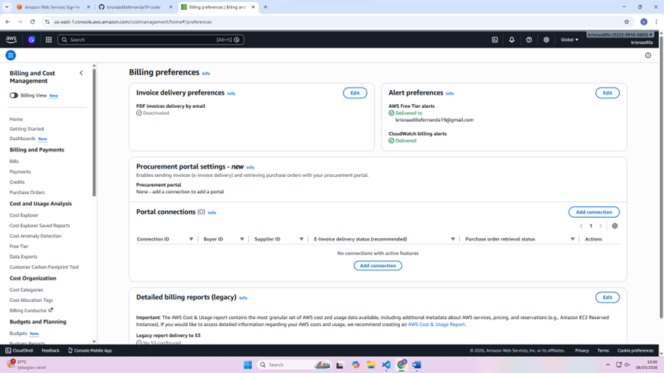

3. Di Alert preferences di klik lalu edit
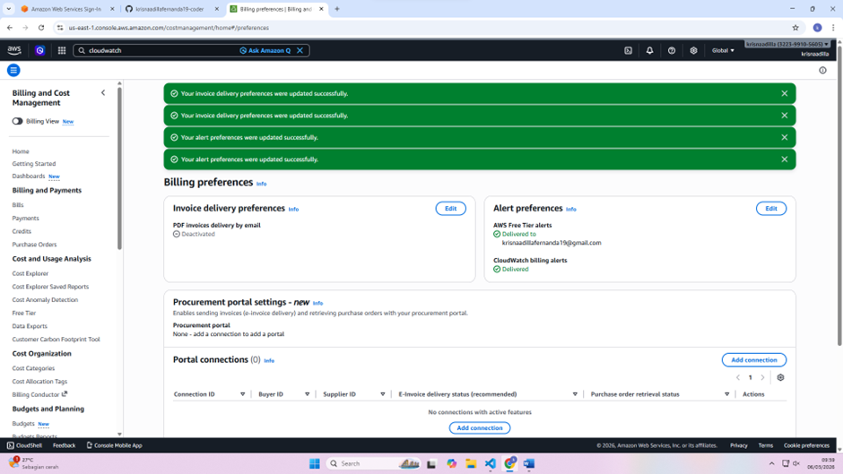

4. Klik bagian Search lalu cari Cloudwatch dan klik
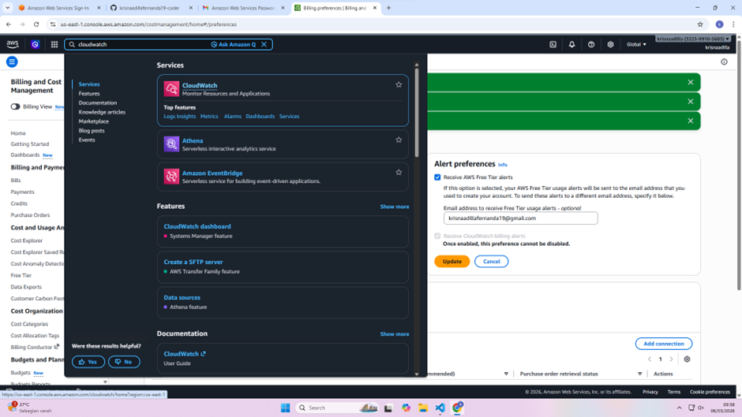

5. Setelah klik maka tampilan nya akan seperti ini. Jika sudah, lalu pilih yang bagian Create Alarms
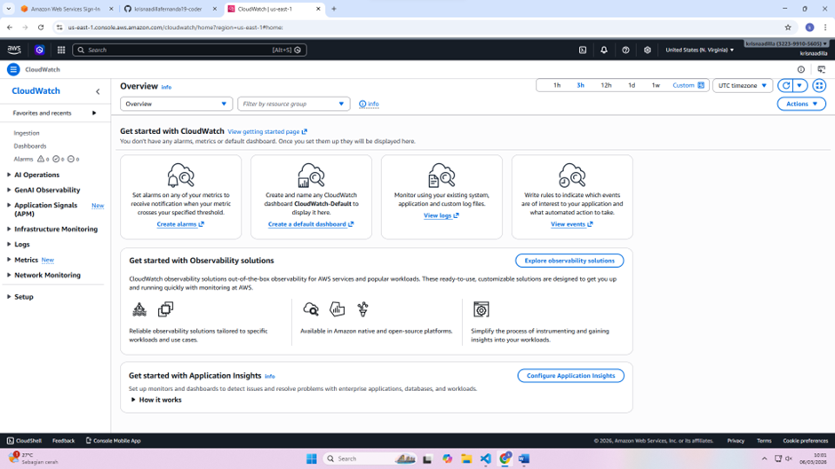

6. Masuk dibagian ini lalu klik Create Alarm

7. Jika sudah seperti ini lalu klik bagian Select metric
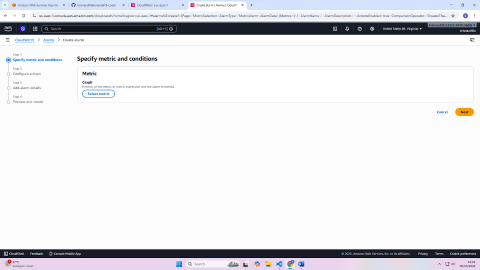

8. Tampilan pada bagian setelah klik Select metric akan seperti ini, lalu klik Billing
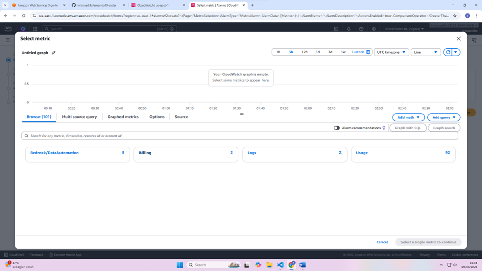

9. Lalu klik Total Estimated Charge
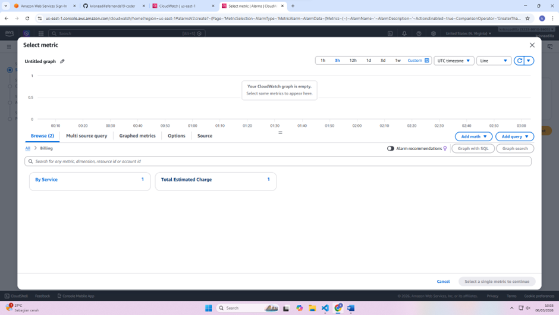

10. Lalu ceklis bagian USD dan klik Select metric
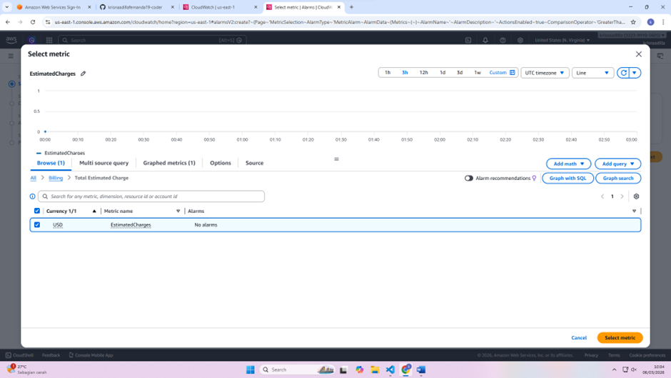

11. Jika tampilan sudah seperti ini, sesuaikan nama kalian
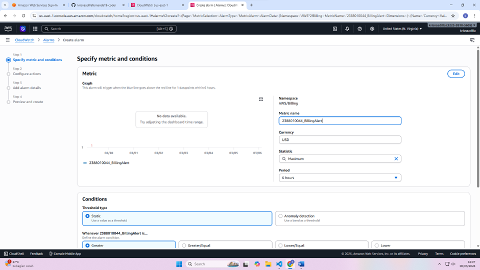

12. Scroll dikit, pilih 1 saja dibagian than dan next
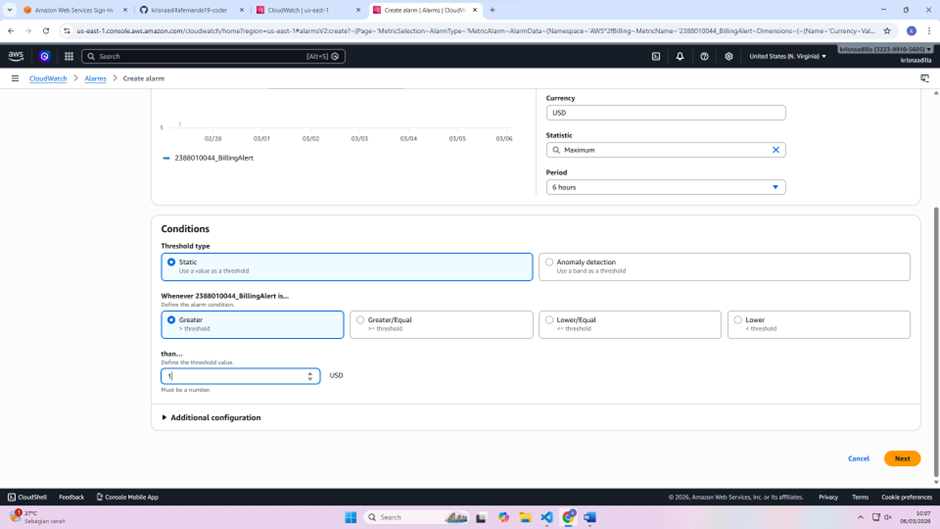

13. Tampilan akan seperti ini
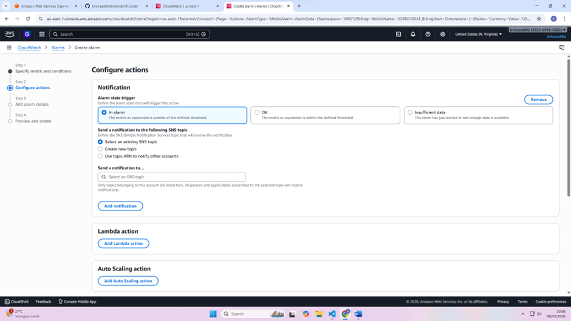

14. Klik Create new topic, sesuaikan nama nya, dan masukkan email valid kalian dan Create topic
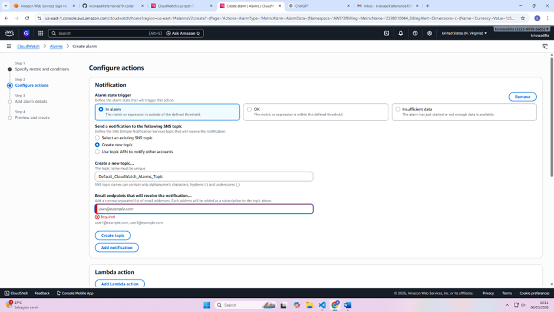

15. Lalu Next saja

16. Setelah Next sesuaikan nama nya lagi kosongkan saja bagian Alarm description dan Next
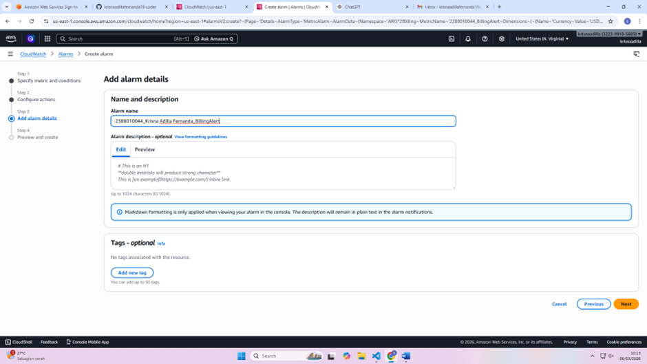

17. Jika sudah seperti ini scroll aja kebawah lalu klik Create alarm
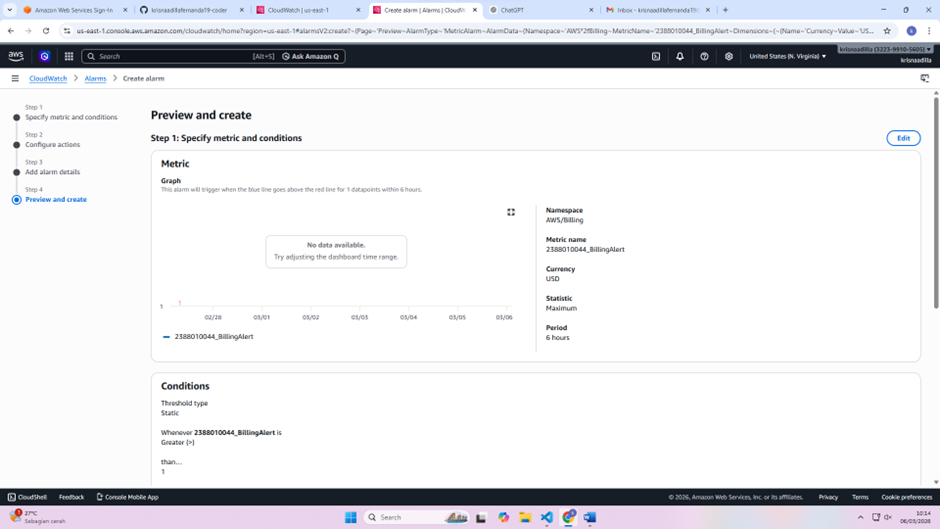

18. Nah sudah selesai tampilan akan seperti ini jika berhasil
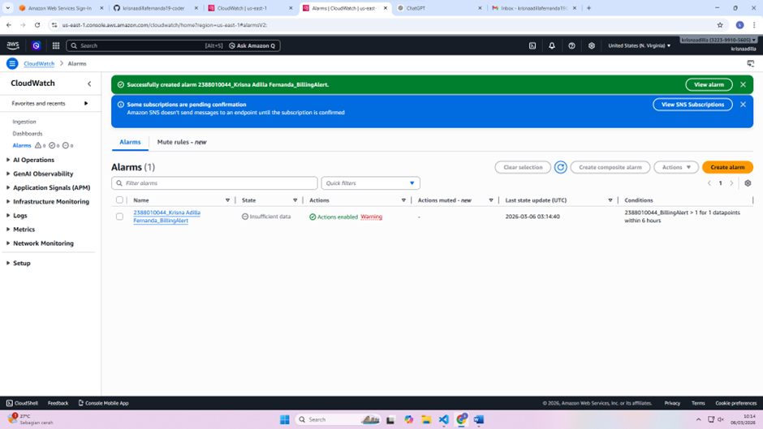