# Membuat VM di AWS EC2 dengan AMI

1. Search  EC2 dan klik
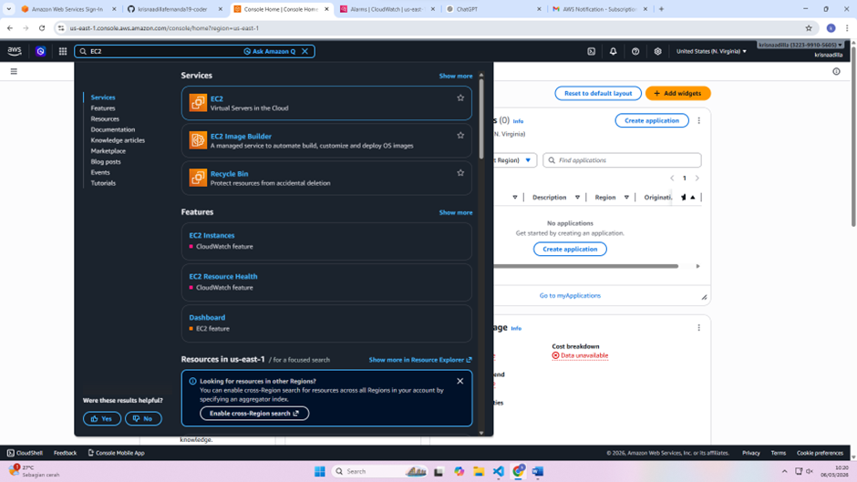

2. Klik Launch Instance
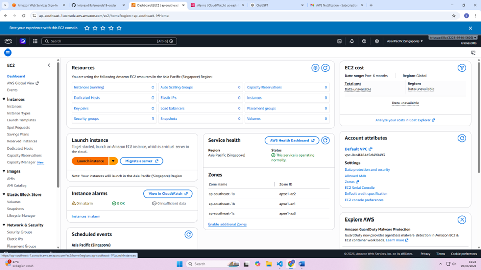

3. Sesuaikan nama kalian
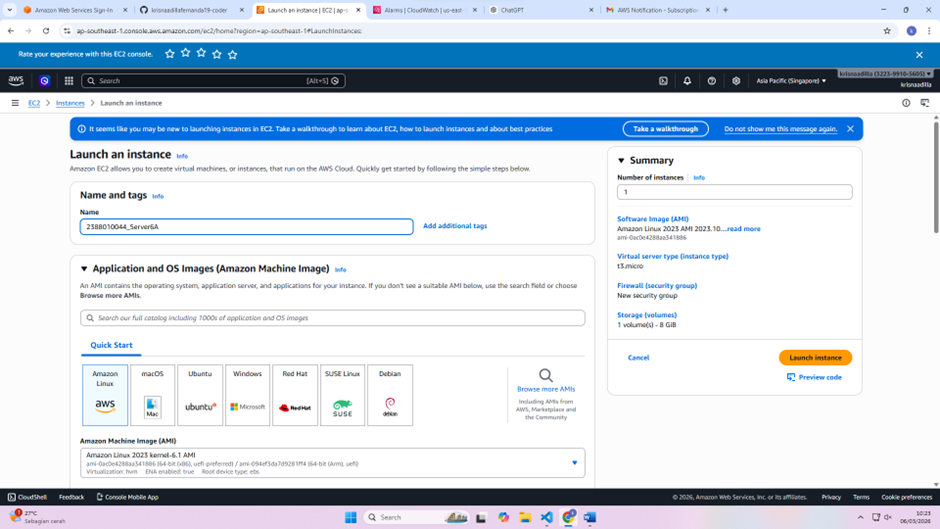

4. Pada bagian Quick Start pilih yang Ubuntu
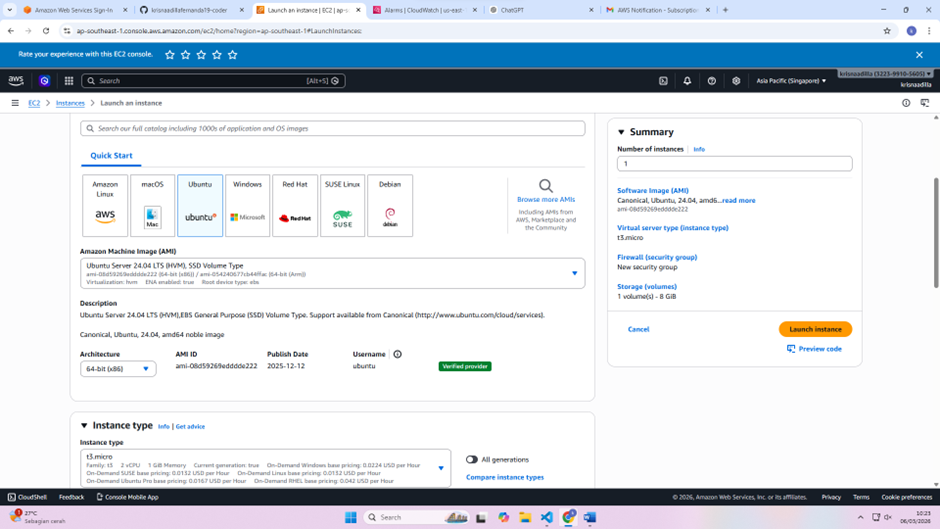

5. Dibagian Instance type pilih yang t3.micro
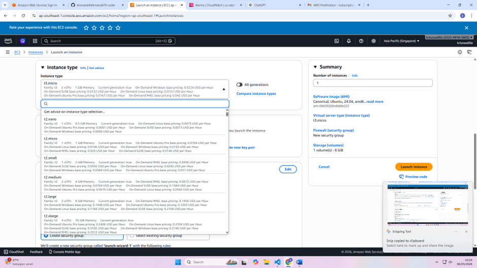

6. Klik pada bagian Create new key pair
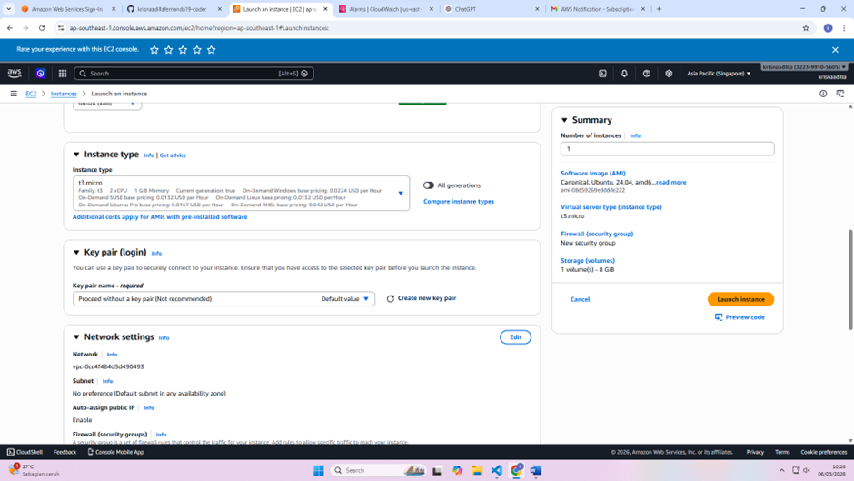

7. Terus sesuaikan nama kalian dan ikuti seperti digambar dan klik Create key pair
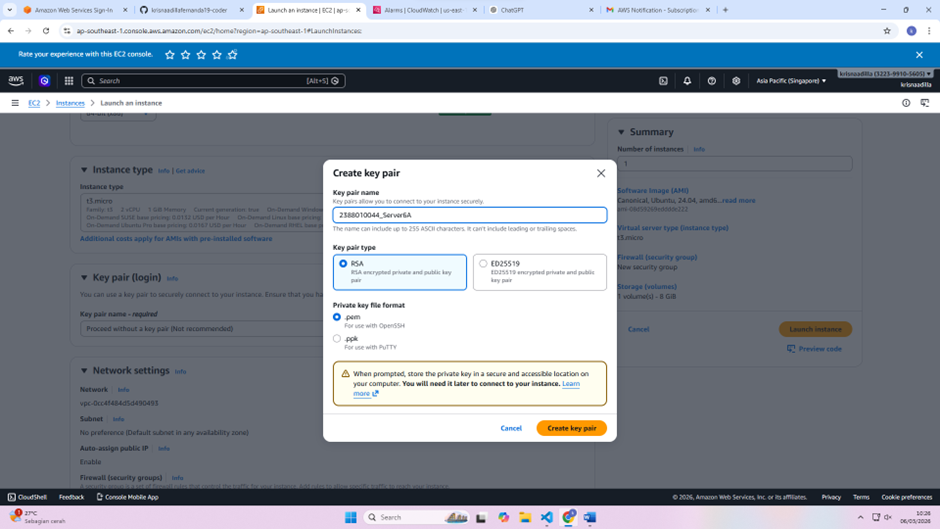

8. Maka akan otomatis download file seperti ini. Ingat file ini jangan sampai hilang!
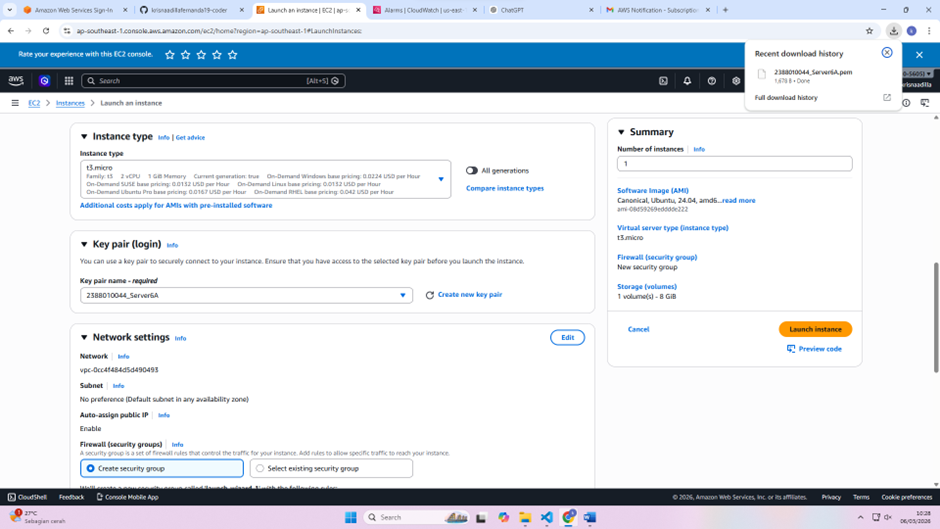

9. Dibagian Network settings sama kan seperti gambar dibawah
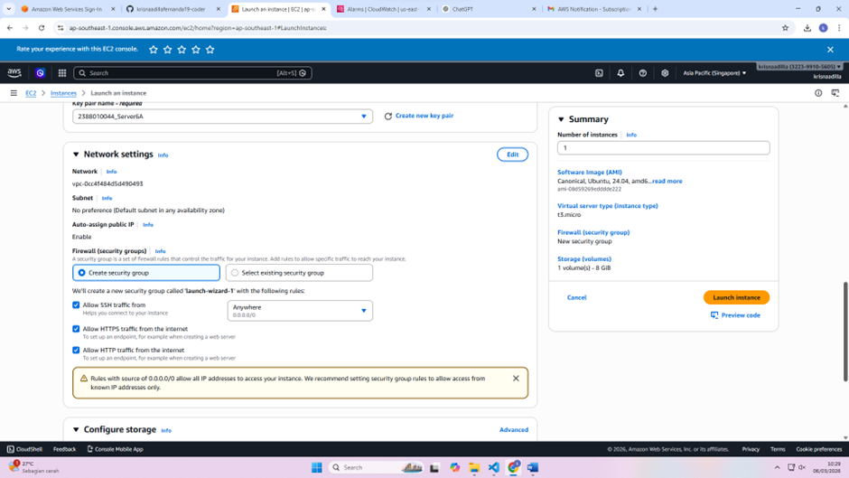

10. Bagian Configure storage naikkan ke 30
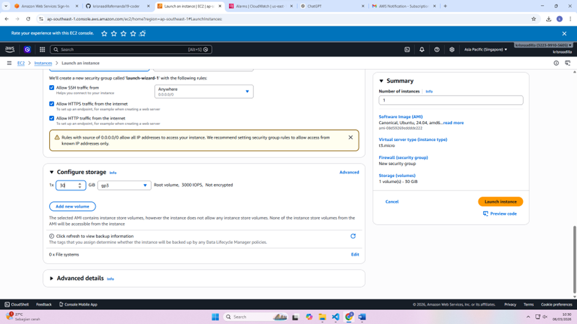

11. Lalu klik Launch Instance
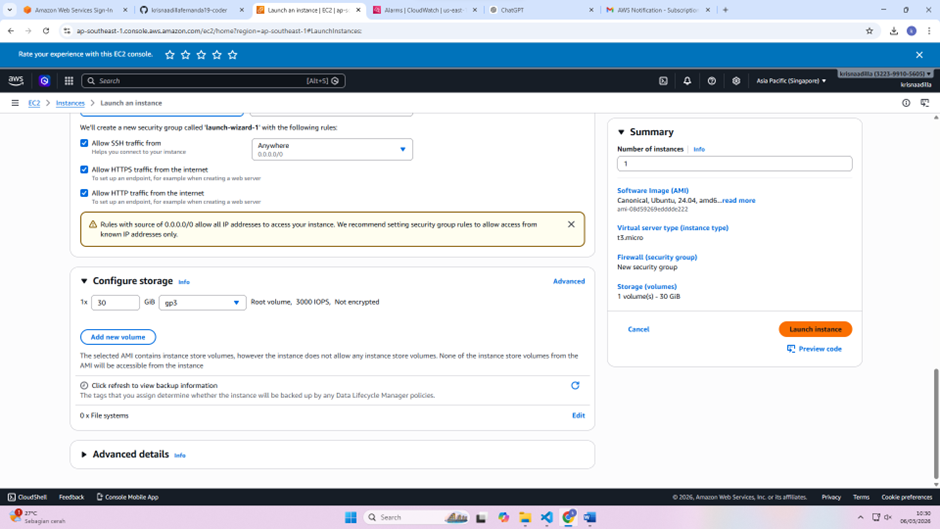

12. Dan Success tampilan akan seperti ini
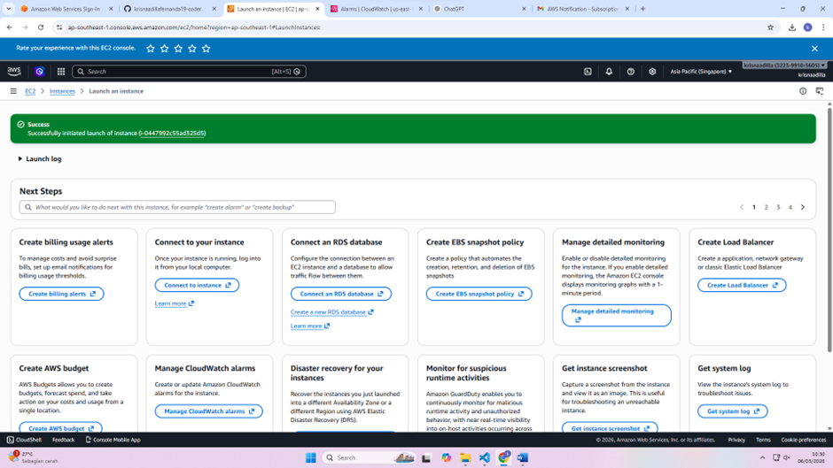
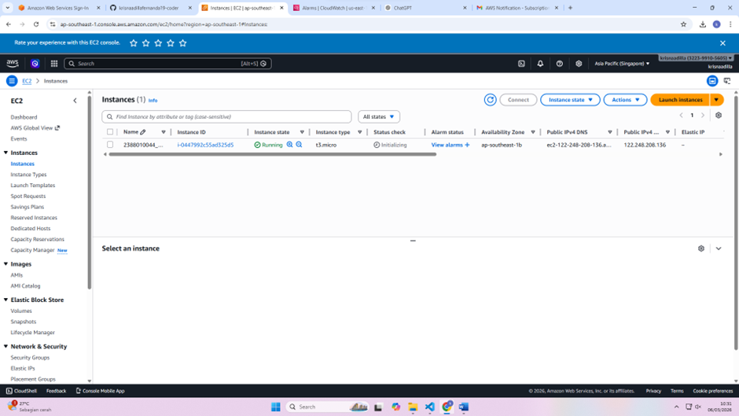
