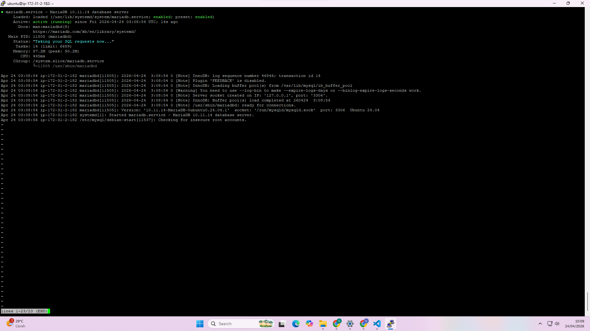
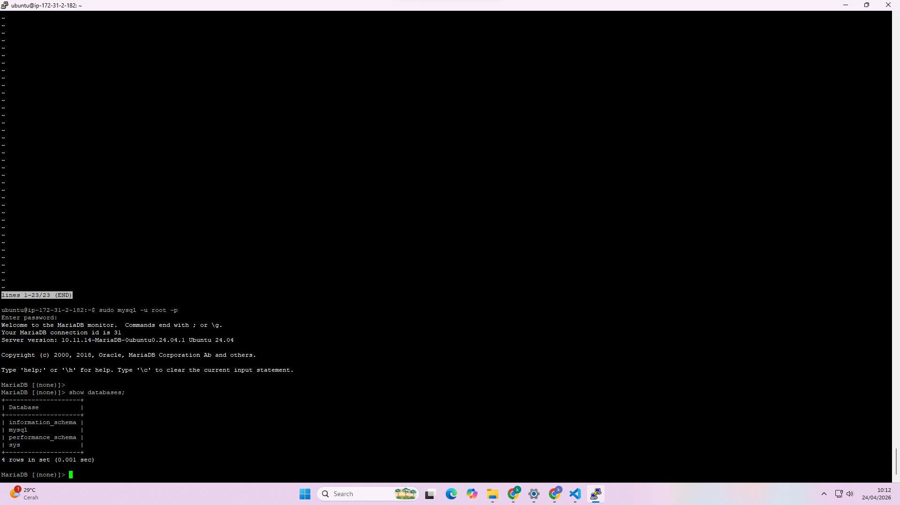
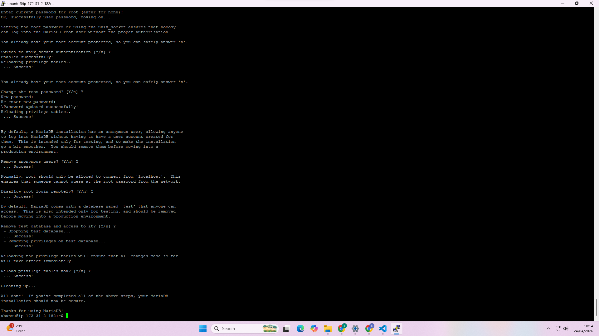
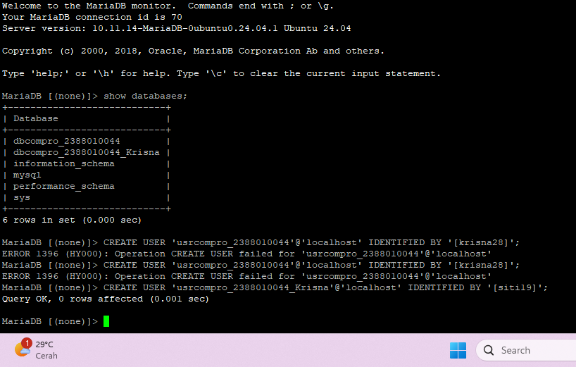
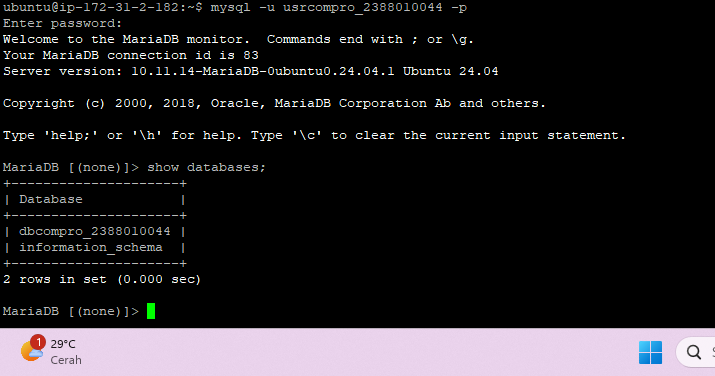

# Setting-up Database di AWS Ec2 menggunakan MariaDb

1. Aktifkan Instance AWs Ec2
2. Remote Instance Via Open SSH Powershell / putty
3. Patching OS (sudo apt-get update && sudo apt-get upgrade)
4. Install MariaDb (sudo apt install mariadb-server -y)
5. Cek Status MariaDb (systemctl status mariadb)

6. Test Default Setting database server login sudo mysql -u root -p

7. Hardening Database Server sudo mysql_secure_installation
- Change the password for the root user = Y
- Remove anonymous users = Y
- Disallow root login remotely = Y
- Remove test database and access to it = Y
- Reload privilege tables = Y

8. Create DB untuk Website Company Profile
- Login sebagai root
- Create DB nama dbcompro_NIM => CREATE DATABASE dbcompro_NIM;
- Create User dengan nama = usrcompro_NIM dan password = [PASSWORD] => CREATE USER 'usrcompro_NIM'@'localhost' IDENTIFIED BY '[PASSWORD]';

- Grant user akses ke DB yang baru dibuat => GRANT ALL PRIVILEGES ON dbcompro_NIM.* TO 'usrcompro_NIM'@'localhost';
- Flush privileges => FLUSH PRIVILEGES;
- exit;
- login sebagai usrcompro_NIM dan cek apakah bisa akses ke DB yang baru dibuat
